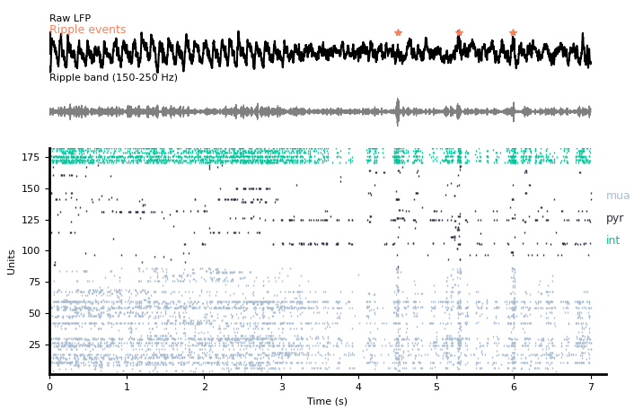

# NeuroPy
Package for analyzing ephys data using python.

### Overview
This package is primarily developed for hippocampal recordings, but can also be used for general ephys data.

### Minimum requirements
* python 3.9
* Numpy 1.20.2
* Scipy 1.6.2

### Installation
Install mamba. See https://mamba.readthedocs.io/en/latest/mamba-installation.html.  
Fork this repository and navigate to the "NeuroPy" directory in bash.
Run the following command from your base environment:  
`mamba env create -f environment.yml`(stable but older)  or 'env create -f environment_beta.yml` (most up-to-date)  
Add your repository to your python path in your favorite python interative environment and start using the code!

### Steps to follow before you start using modules:

   * Make sure your data folder has `.xml` and `.eeg` files.
   * Open the `.eeg` file in neuroscope and categorize bad recording channels as `skipped` and non-lfp channels as `discard` in neuroscope


### Quick example

```python
"""
Raster plot with corresponding raw LFP, ripple band and example ripple events
"""
from neuropy.core import Neurons
from neuropy import plotting
spiketrains = np.array([np.sort(np.random.rand(_)) for _ in range(100,200)],dtype=object) 
neurons = Neurons(spiketrains,t_stop=1000)

plotting.plot_raster(neurons,color = 'jet')

```



### Citing this package
If you use NeuroPy in your research, please consider citing it.

```
@misc{neuropy2021,
    author       = {Bapun Giri, Nat Kinsky},
    title        = {{NeuroPy: Electrophysiology analysis using Python}},
    year         = 2020--2021,
    version      = {0.0.1},
    url          = {https://github.com/diba-lab/NeuroPy}
    }
```
