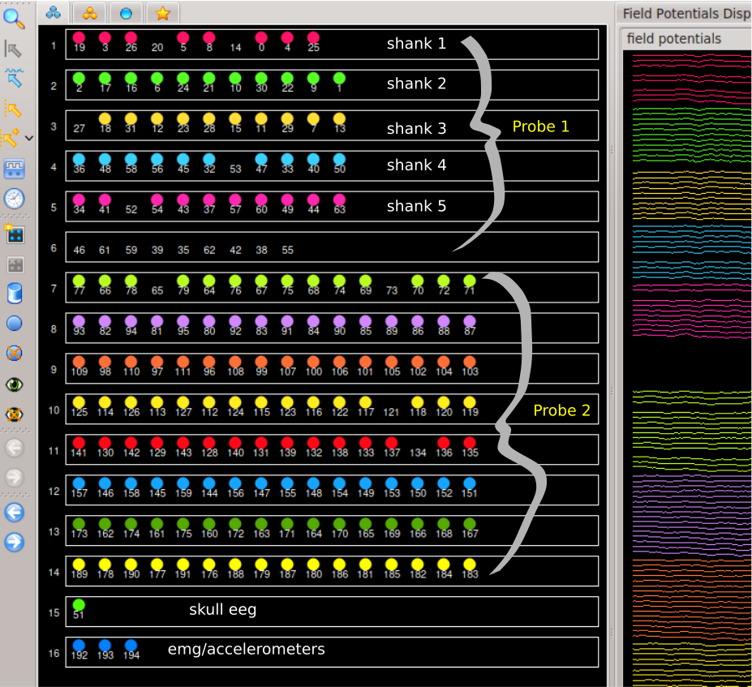

## **Prerequisite**
* You need to have atleast .eeg and .xml(neuroscope) files in your datafolder.
* Open the .eeg file in neuroscope
* Mark bad channels as skipped (an option in neuroscope)
* Channels should be grouped into shanks. The processing pipeline also supports multiple probes. For example, if you have two probes then list all shanks of probe-1 followed by all shanks of probe-2.
* Channels recording skulleeg, emg, accelerometer should be grouped separately

Below is a snapshot describing the same




## **Pointing the pipeline to data folder**
All data sets are processed by importing `processData` pipeline
```python
from callfunc import processData
basepath = "/path/to/my/data/folder/"

sess = processData(basepath) # the pipline
```
## **Create basic recording info for the data**
We will parse .xml file to create .basics.npy where all info related to recording are kept. Use the following
```python
sess.recinfo.makerecinfo(nShanks=[6,8], skulleeg=15, motion=[192,193,194])
```
## **Create Epochs**
Typically a sessions multiple epochs such sleeping in homecage and then running on a maze. You can define these using the following.
```python
#all are defined in seconds
epoch_dict = {'pre':[0,2000],'maze':[2000,3000],'post':[3000,6000]}
sess.epochs.make_epochs(new_epochs=epoch_dict)
print(sess.epochs)
```

## **Detecting artifact timepoints**
Sometimes data within a session has brief periods of cable disconections or artifacts. These cause issues in automatic spike-sorting, sleep detection etc. You can use the artifact module to detect these timepoints by using simple zscore measure.
```python
sess.artifact.usingZscore(thresh=5)
```
This creates `.artifact.npy` in the basepath folder containing start and end of artifacts in seconds.
You can use `sess.artifact` to create an ascii file of timestamps to be used by `spykng-circus` or `neuroscope`.

```python
sess.artifact.export2circus()
sess.artifact.export2neuroscope()
```
## **Create probemap for the electrodes**
Probemaps can be created by specifying `xypitch`, which is a tuple where first element is distance between electrodes along `x-axis` and seconds element distance along `y-axis`  
```python
sess.recinfo.probemap.create(xypitch=(20,30)) # tetrode type config
sess.recinfo.probemap.create(xypitch=(0,15)) # linear probe
```
You can also create `.prb` file to be used by `spyking-circus`

```python
sess.recinfo.probemap.for_circus()
```